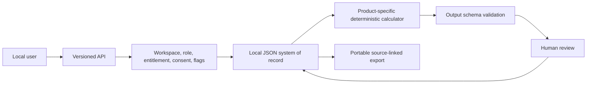

# Data Dictionary

| Entity | Important fields | Decision |
| --- | --- | --- |
| Workspace | ID, members, entitlements, flags, consent | Tenant boundary for every object and action |
| Session | actor ID, workspace ID, role, display name | Fixed non-secret local fixture only |
| Product | SKU, object type, modules, fields, task, metrics, boundaries | Immutable registry of exactly ten distinct products |
| Artifact | ID, workspace/product, object type, fields, status, revision, version history | Human-authored system of record; never overwritten by analysis |
| Evidence | ID, label, source type, content, SHA-256 digest, captured time, immutable-original flag | Raw local content is sensitive; audit excludes it |
| Analysis | source revision, task/provider, output, review state, correction | Derived sensitive content stored separately from artifact |
| Metric | name, numeric value, unit, formula, inputs, rounding | Every visible number explains its method |
| Claim | text, basis, evidence IDs, inference flag | Source-linked calculated or user-declared statement |
| Job | task, status, stage, attempts, cancellation/dead-letter fields | Synchronous preview lifecycle; distributed worker deferred |
| Audit event | actor/entity/action/time/correlation/privacy/redacted payload | No raw private fields or evidence text |
| Idempotency record | workspace, scope, key, remembered result, time | Duplicate mutation protection; bounded to 1,000 |
| Deleted artifact | artifact fields plus recovery deadline | Owner-recoverable for 30 days in preview |

## Provenance classes

- `user_provided`: entered evidence or declared assumption.
- `source_fact`: a statement explicitly labeled observed or source-attributed.
- `user_inference`: a statement explicitly labeled inferred by the user.
- `calculated`: deterministic output from exposed formula and inputs.
- `user_claim`: a claim awaiting evidence review; not promoted to fact.

## Flow

No flow leaves the local process in this implementation.
